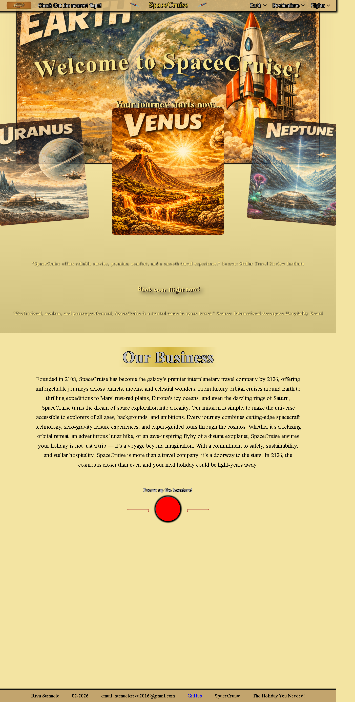
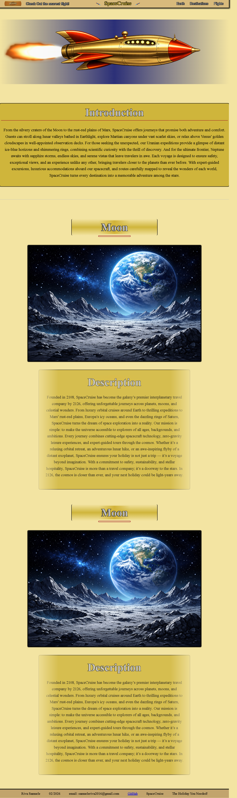
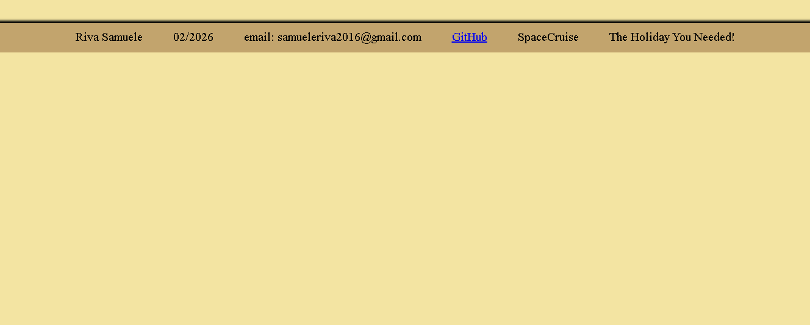

# SpaceCruise

## Italiano

### Anteprime
#### Home page


#### Destinations page


#### Flights page


### Descrizione del progetto
SpaceCruise e' un progetto web front-end con integrazione back-end di base, pensato come sito promozionale per una compagnia immaginaria di viaggi spaziali.

Il progetto combina:

- pagine HTML statiche collegate tra loro
- CSS personalizzato per layout, animazioni e componenti visivi
- JavaScript per interazioni, animazioni, osservatori di scroll e logica dinamica
- un server Node.js con Express e PostgreSQL per una semplice API di esempio sui voli

L'idea generale e' presentare un brand sci-fi chiamato SpaceCruise attraverso una home page ricca di animazioni, una pagina dedicata alle destinazioni e una struttura pronta a crescere con sezioni aggiuntive come voli, offerte e contenuti dinamici.

### Obiettivi del progetto
Questo progetto e' utile per:

- esercitarsi con HTML, CSS e JavaScript su un sito reale multi-pagina
- sperimentare animazioni, effetti hover, SVG con testo curvo e osservatori di viewport
- collegare un front-end statico a un piccolo back-end Express
- testare una connessione a PostgreSQL tramite endpoint REST molto semplice

### Struttura del progetto
- `home.html`: pagina principale del sito, con hero section, recensioni, sezione business e catalogo/offerte dinamiche
- `destinations.html`: pagina dedicata alle destinazioni spaziali, con introduzione e presentazione visiva dei pianeti
- `flights.html`: pagina predisposta ma attualmente ancora minimale
- `styles.css`: foglio di stile principale per tutto il progetto
- `script.js`: logica client-side, animazioni, observers, gestione elementi dinamici e chiamata API di esempio
- `server.js`: server Express con endpoint `/api/flights` e configurazione PostgreSQL
- `package.json`: configurazione npm con dipendenze e script di avvio del progetto
- `img/`: immagini del brand, navicelle, pianeti, sfondi e asset grafici vari
- `docs/screenshots/`: immagini usate nel README per mostrare l'interfaccia del progetto
- `appunti.txt`: file di appoggio per note o contenuti di lavoro

### Funzionalita' principali
- Hero section con titolo curvo SVG e animazioni visive
- Navigazione superiore con menu a tendina e frecce personalizzate
- Sezioni animate all'ingresso in viewport tramite `IntersectionObserver`
- Area recensioni con titolo centrale curvo e layout responsivo
- Sezione offerte casuali con pianeti cliccabili e aggiornamento dinamico di titolo e descrizione
- Effetti grafici su astronavi, sfondi e immagini decorative
- Caricamento dati di esempio da `/api/flights`

### Tecnologie usate
- HTML5
- CSS3
- JavaScript vanilla
- Node.js
- Express
- PostgreSQL
- `pg` per la connessione al database

### Avvio del progetto
#### 1. Avvio solo front-end
Se vuoi vedere il sito come pagine statiche, puoi aprire direttamente `home.html` nel browser. Alcune funzioni pero' dipendono dal server e dall'API.

#### 2. Avvio completo con server
Assicurati di avere installato Node.js e PostgreSQL.

Installa le dipendenze:

```bash
npm install
```

Avvia il server:

```bash
npm start
```

Poi apri il browser su:

```text
http://localhost:3000
```

### Configurazione database
Il file `server.js` usa una connessione PostgreSQL tramite `Pool`.

Attualmente il progetto si aspetta:

- host: `localhost`
- porta: `5432`
- database: `spacecruise`
- tabella: `flights`

Prima di usare il backend conviene:

- creare il database `spacecruise`
- creare una tabella `flights`
- sostituire nel file `server.js` le credenziali con quelle corrette del tuo ambiente
- evitare di lasciare password reali scritte direttamente nel codice

### Endpoint disponibile
```text
GET /api/flights
```

Restituisce i record della tabella `flights` in formato JSON.

### Note sullo stato attuale del progetto
- La home page e' la parte piu' completa e curata del progetto.
- La pagina `destinations.html` contiene gia' una sezione introduttiva ben sviluppata.
- La pagina `flights.html` e' ancora essenziale e puo' essere ampliata.
- In `script.js` ci sono alcune sezioni sperimentali o in evoluzione, utili per continuare lo sviluppo.

### Known issues
- Alcune parti di `script.js` assumono la presenza di elementi che non esistono in tutte le pagine, quindi alcune view possono generare errori JavaScript se aperte senza controlli aggiuntivi.
- La chiamata a `/api/flights` funziona correttamente solo quando il progetto viene eseguito tramite server Express, non aprendo semplicemente i file HTML in locale.
- Le credenziali PostgreSQL sono ancora hardcoded in `server.js` e dovrebbero essere spostate in variabili d'ambiente.
- `flights.html` e' ancora una base vuota e non rappresenta ancora una pagina funzionale completa.

### Miglioramenti possibili
- spostare la configurazione database in variabili d'ambiente
- completare la pagina voli
- separare il JavaScript in moduli piu' piccoli
- migliorare accessibilita' e navigazione da tastiera
- aggiungere una versione mobile ancora piu' rifinita

---

## English

### Screenshots
#### Home page


#### Destinations page


#### Flights page


### Project description
SpaceCruise is a front-end web project with a small back-end integration, designed as a promotional website for a fictional space travel company.

The project combines:

- connected static HTML pages
- custom CSS for layout, animations, and visual components
- JavaScript for interactions, scroll effects, observers, and dynamic UI logic
- a Node.js server with Express and PostgreSQL for a simple example flight API

The main idea is to present a sci-fi travel brand called SpaceCruise through an animated landing page, a destination-focused page, and a structure that can later grow into a fuller booking or catalog experience.

### Project goals
This project is useful for:

- practicing HTML, CSS, and JavaScript on a real multi-page website
- experimenting with animations, hover effects, SVG curved text, and viewport observers
- connecting a static front-end to a lightweight Express backend
- testing a basic PostgreSQL REST endpoint

### Project structure
- `home.html`: main landing page with hero section, reviews, business section, and dynamic offers/catalog area
- `destinations.html`: page dedicated to space destinations and planet presentation
- `flights.html`: prepared page that is still minimal at the moment
- `styles.css`: main stylesheet for the whole project
- `script.js`: client-side logic, animations, observers, dynamic elements, and example API call
- `server.js`: Express server with `/api/flights` endpoint and PostgreSQL configuration
- `package.json`: npm configuration with dependencies and project scripts
- `img/`: logos, spaceships, planets, backgrounds, and visual assets
- `docs/screenshots/`: images used in the README to preview the UI
- `appunti.txt`: support file for notes and work-in-progress content

### Main features
- Hero section with curved SVG title and visual animations
- Top navigation with dropdowns and custom arrows
- Scroll-based reveal animations using `IntersectionObserver`
- Review section with a centered curved title and responsive layout
- Random offer section with clickable planets and dynamic title/description updates
- Decorative spaceship and background effects
- Example data loading from `/api/flights`

### Technologies used
- HTML5
- CSS3
- Vanilla JavaScript
- Node.js
- Express
- PostgreSQL
- `pg` for database connectivity

### Running the project
#### 1. Front-end only
If you only want to preview the static website, you can open `home.html` directly in a browser. Some features, however, depend on the server and the API.

#### 2. Full project with server
Make sure Node.js and PostgreSQL are installed.

Install dependencies:

```bash
npm install
```

Start the server:

```bash
npm start
```

Then open:

```text
http://localhost:3000
```

### Database setup
The `server.js` file connects to PostgreSQL through a `Pool`.

The current project expects:

- host: `localhost`
- port: `5432`
- database: `spacecruise`
- table: `flights`

Before using the backend, it is recommended to:

- create the `spacecruise` database
- create a `flights` table
- replace the credentials in `server.js` with your own environment values
- avoid keeping real passwords hardcoded in source files

### Available endpoint
```text
GET /api/flights
```

Returns rows from the `flights` table as JSON.

### Current project status
- The home page is currently the most complete and polished part of the project.
- `destinations.html` already includes a developed introduction section.
- `flights.html` is still very minimal and ready for expansion.
- `script.js` contains some experimental or evolving sections that can support future development.

### Known issues
- Some parts of `script.js` assume that certain DOM elements exist on every page, so a few views can still throw JavaScript errors without extra guards.
- The `/api/flights` request only works correctly when the project is served through the Express server, not when opening the HTML files directly from disk.
- PostgreSQL credentials are still hardcoded in `server.js` and should be moved to environment variables.
- `flights.html` is still mostly a placeholder and does not yet represent a complete functional page.

### Possible improvements
- move database credentials to environment variables
- complete the flights page
- split JavaScript into smaller modules
- improve accessibility and keyboard navigation
- refine the mobile experience further